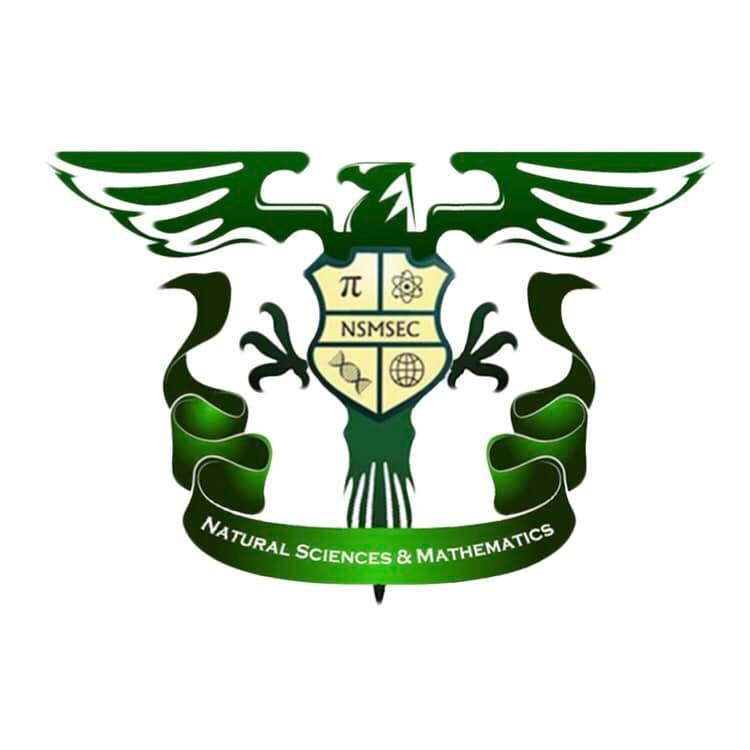

   

# 
Ateneo de Davao University - Natural Sciences and Mathematics

### Skills Inventory System
##### 
This project is a skills inventory system designed for the Ateneo de Davao University School of Natural Science and Mathematics. It would allow a resource manager to manage resources and the skills attached to them. Key functions available to the resource managers are the adding, removing, updating, and finding of skills/resources. Additionally, the managers can assign a relationship between the a skill and a resource.

---

### Possible sub-system
* Student Information System
* Form System (to determine skills)
* History System

---

#### Frameworks Included
*  Firestore
*  Express
*  Angular
*  node
